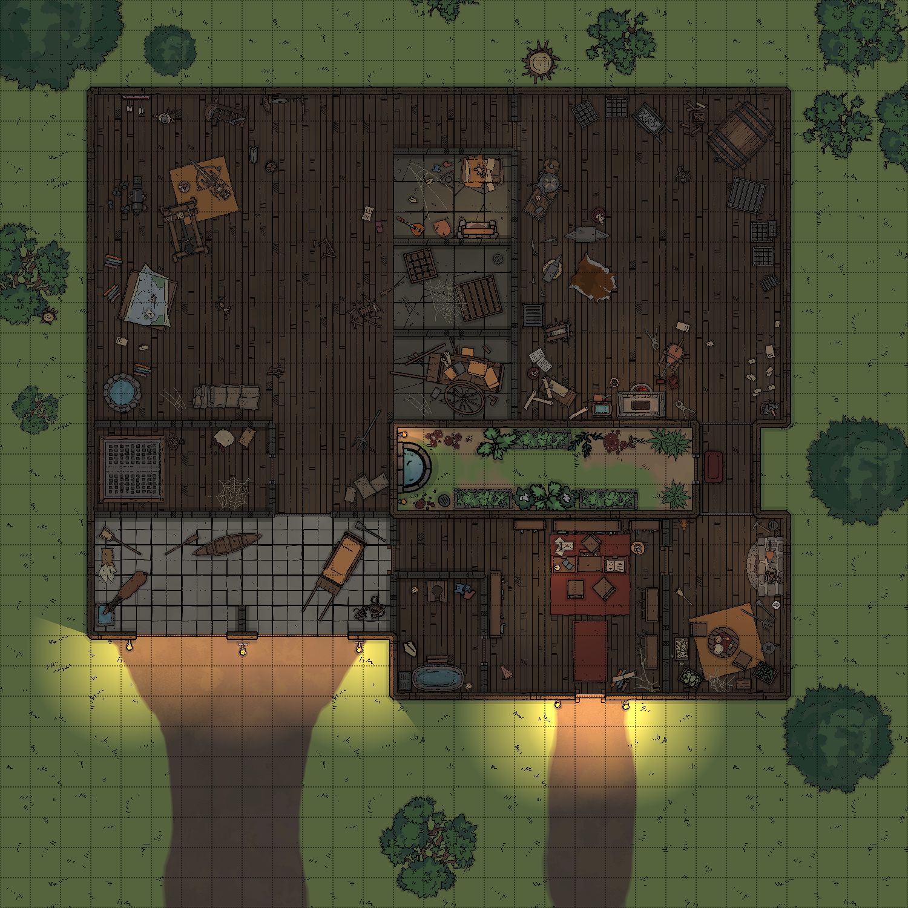

# Vox Seeker Workshop

* Challenge Rating: 1
* Difficulty: Medium to Hard

## Summary

An engineer's workshop has gone haywire, all of the machinery is running out of control, the lights are flickering on and off and disorienting anyone who enters. Four [vox seekers](https://www.dndbeyond.com/monsters/vox-seeker) have escaped from their docking clamps and are nesting on the ceiling, and on their turn will move toward the nearest creature who has spoken in their vicinity.

## Combat Details

The four vox seekers will move in a straight line toward the nearest character who spoke within 60 feet.

A large number of gyros and other minor constructs move at random about the shop. These constructs have 1 HP, and an Armor Class of 12. For the sake of simplicity, you can break these down into four groups, and have them move in a specific initiative order.

DM's NOTE: None of the constructs described below are combatants. The movement of these constructs is intended to distract and disorient the players, making it difficult to tell them apart from the real aggressors, the vox seekers.

### Group 1

**Initiative 15:** Four small rolling constructs move 20 feet straight toward a wall, rebound off of it, then move straight in a random direction.

### Group 2

**Initiative 12:** Three small ambulatory constructs move 15 feet, changing directions randomly every 5 feet.

### Group 3

**Initiative 8:** Three small rolling constructs move 20 feet directly toward a random creature, then change directions after bumping into the creature.

### Group 4

**Initiative 4:** Five spider constructs move 15 feet away from any creatures. 

## Treasure

Bronze clock parts totalling 5 pounds in weight apiece, valued at 3gp for the complete parts, or 50sp for the raw materials. The original creator will pay a reward of 5gp to have his parts returned.

## Creatures

[Vox Seeker](https://www.dndbeyond.com/monsters/vox-seeker)

## Maps

### Workshop Map

(Tip: Right click the links below and click "Save Link As...")

[1500x1500](1500x1500.png) | [2250x2250](2250x2250.png) | [3000x3000](3000x3000.png)

[DungeonDraft](DungeonDraft.dungeondraft_map) | [Universal Virtual Tabletop](VirtualTableTop.dd2vtt)
